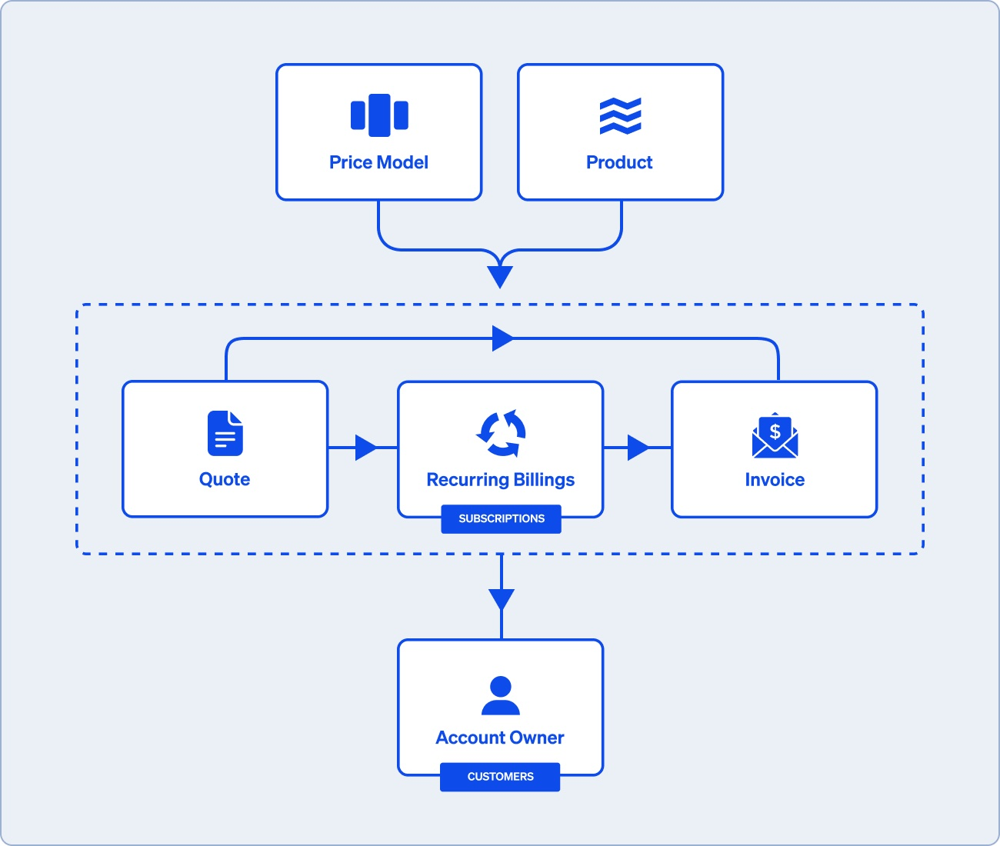

If you want to get started with practical introduction, head over to the quick
start guide.

Aqueduct handles billing and processes such as quoting, invoicing, and
collections that depend on or feed into the billing logic. First you configure
your billing logic in the **Price Model**, and then you can use it to create
**Quotes**, kick off **Subscriptions**, or collect **Invoices**.

## Billing logic

**Price models**: Most Aqueduct functionality starts with a Price Model. The
Price Model allows you to quickly specify how you want to collect money by
configuring 3 things:

- Price functions: How much to charge for something. For example, $25 per 10,000
  API calls or $100 per hour of service. Multiple price functions can live in a
  price model.
- Billing frequency: How often to execute a pricing function. For example, one
  time, monthly, or annually.
- Billable events: Events that happen your product that you want to charge for
  in your price function. For example, if you charge $25 per 10,000 API calls,
  then you will want to send the number of API to the price model. Aqueduct
  aggregate the number of events on the billing frequency configured in the
  price model.

See Common business models to see examples of how a subscription business,
metered business, or platform can represent their business model on Aqueduct.

## Products

**Product**: What you’re selling. The product doesn't affect the any numerical
calculations. It is used for displaying line items on invoices, calculating
analytics, and managing provisioning state. Multiple prices can be used with the
same product if you sell the same product at different price points.

## Price model outputs

**Invoices**: Aqueduct creates invoices to collect payments for the amount owed
as collected by the price model. Aqueduct sits on top of payment providers such
as Stripe, Airwallex, and ACH.

**Subscriptions**: Subscriptions allow customers to make recurring payments.
Price models with a recurring billing frequency will produce subscriptions.
Subscriptions will create an invoice each billing period to collect any amounts
owed.

<Note>

**Subscriptions, installments and recurring billings!**

We support recurring billing all all its glorious variations. Request access
from onboarding@tryaqueduct.com if you want access to installment plans or
recurring billings.

**Subscriptions**: Typically the customer prepays for access to the product and
renews with no obligation to continue for subsequent billing period. Ex:
Spotify, Netflix, NYtimes.

**Installment plans**: A total amount that is paid over multiple periods.
Differs from subscriptions in that customer is required to pay the full amount.
Ex: Placing a deposit on a wedding venue for 25%, paying another 25% 3 months
out, and the full remaining balance 2 weeks before the wedding.

**Recurring billings**: Recurring billing is a broad term that may include
subscriptions but often used to refers to when the customer runs up a tab and is
charged for good and services on a pre-arranged schedule. Usage based price
models and professional services are often billed this way.

</Note>

**Quotes** : Aqueduct allows you to provide your customer quotes based on a
price model. Once a quote is accepted, it will become an invoice if the billing
frequency is one time or a subscription if it has a recurring billing frequency.
Creating a quote takes less than a minute on Aqueduct because quotes are
associated with product models. This means you only need to input details
specific to the customer such as their email. You don't need to reconstruct the
shape of each deal by manually adding each line item one by one.

## Accounts

**Account Owner**: Account owners represent an entity that can pay or receive
funds via Aqueduct. Account owner corresponds to the concept of Customer on many
other platforms such as Stripe.

**Money Account**: This is a balance associated with an Account Owner which
represents amounts that the Account Owner owes or is owed.

<Note>

**Why "account owner" instead of "customer" or "account"?**

Other system use the terms "customer" or "account" instead.

We use account owner to be able to precisely describe more nuanced scenarios.
For example, when selling to a corporation, you may want to model out a customer
hierarchy where multiple accounts roll up and are paid by a single entity. Or
your business model may have an element of payouts where the term customer is
not quite appropriate. For example, an on demand delivery platform have
customers who pay for the deliveries and vendors who are paid for doing the
deliveries.

</Note>
